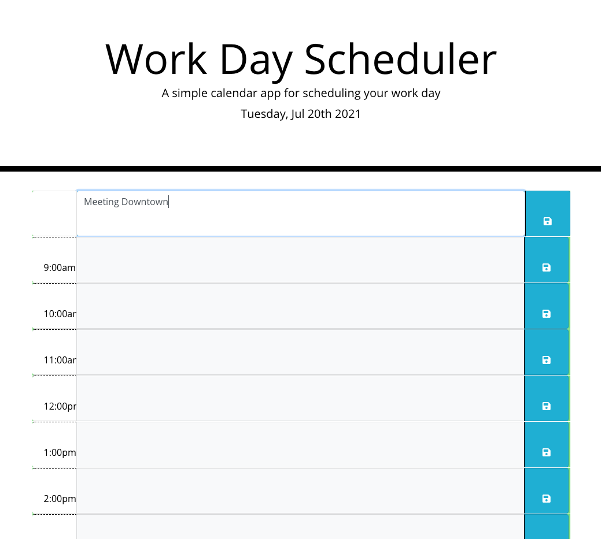

# Work Day Scheduler

## Description
Work day scheduler is a time blocking application that uses third-party APIs. JQuery for it's functionality, Moment.js for it's timeblocking, Bootstrap for it's responsive design, and font-awesome for icons.

## Functionality

* Allows users to create a daily schedule
* Current day is displayed at the top of the calendar using Moment.js
* Presented with timeblocks during normal business hours 8am-6pm.
* Timeblocks are color-coded based on the hour to indicate whether it is in the past, present or future. Turns red if the task or meeting is overdue, is green to show current time, and gray to show future events and meetings.
* When users click on a time block, Jquery uses focus and blue to change to a textarea to allow users to add in their custom schedule.
* WHen a user clicks save, it is saved to local storage
* When a user refreshes their browser or revisits the scheduler, schedule data persists from local storage and assigned to designated time blocks.

## Languages
* JQuery
* Moment.js
* Bootstrap
* Font-awesome
* HTML
* CSS

## Website
https://joshacross.github.io/workday-scheduler

## Photos

